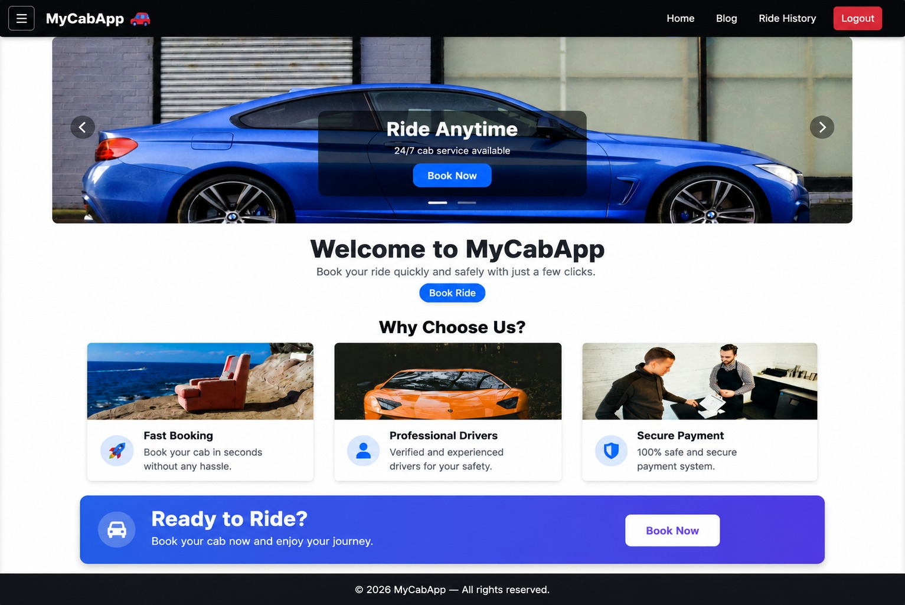
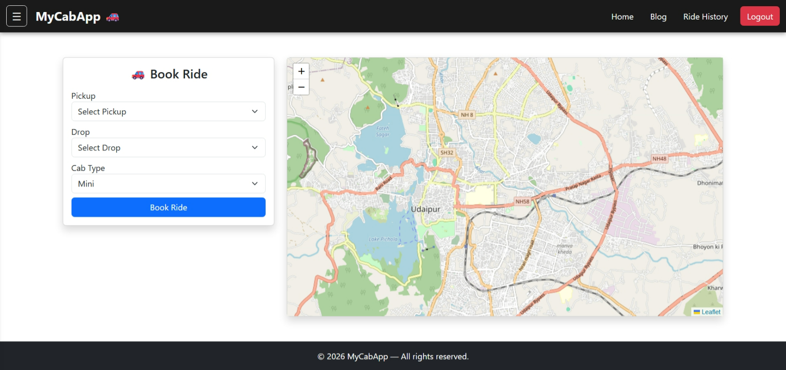

# 🚖 Cab Booking App

A modern and responsive cab booking web application built using **React**, **Bootstrap**, and **Node.js**.
This project focuses on creating a smooth user experience for booking rides with clean UI, responsive layouts, and interactive features.

The application includes authentication pages, booking sections, map integration, and multiple dynamic UI components.

---

# 🚀 Features

* 🚕 Cab booking interface
* 🔐 Login & Signup pages
* 📍 Map integration
* 🎠 Interactive carousel
* 📱 Fully responsive design
* ✨ Modern UI components
* ⚡ Smooth navigation with React Router
* 💳 Payment section UI
* 🧾 Ride history section
* 📂 Organized component structure

---

# 🛠️ Tech Stack

## Frontend

* React.js
* React Router DOM
* Bootstrap
* JavaScript
* CSS

## Backend

* Node.js
* Express.js

---

# 📸 Screenshots

## Home Page

---

## Map / Booking Section


---

# ⚙️ Installation

```bash
npm install
npm start
```

Open in browser:

```text
http://localhost:3000
```

---

# 📂 Project Structure

```text
src/
components/
pages/
assets/
```

---

# 🌟 Purpose of Project

Cab Booking App was created to practice responsive frontend development, routing, UI design, authentication flow, and building a real-world styled web application using React and Node.js.

---

# 👩‍💻 Author

Karina Choudhary
